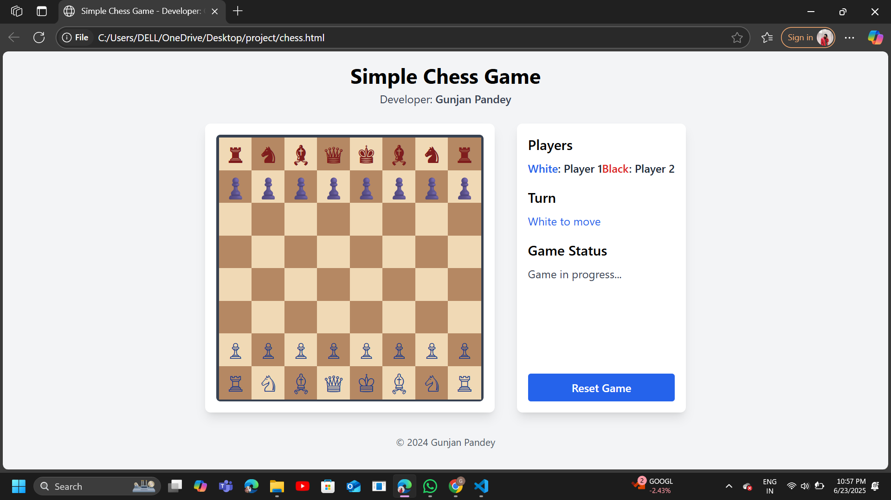

# ♟️ Simple Chess Game
Interactive chess game with move logic, highlighting, and reset functionality using HTML, Tailwind CSS, and vanilla JavaScript.

A simple 2-player chess game built using **HTML**, **Tailwind CSS**, and **Vanilla JavaScript**.

## 👨‍💻 Developer
Gunjan Pandey

## 🔧 Features
- Interactive chess board using Unicode pieces
- Move highlighting and capturing
- Pawn promotion
- Turn-based logic (White vs Black)
- Game over detection (King captured)
- Reset button to restart game
- Clean layout with Tailwind CSS

## 📸 Screenshot

## 🛠️ Technologies Used
- HTML5
- Tailwind CSS (via CDN)
- JavaScript (Vanilla)

